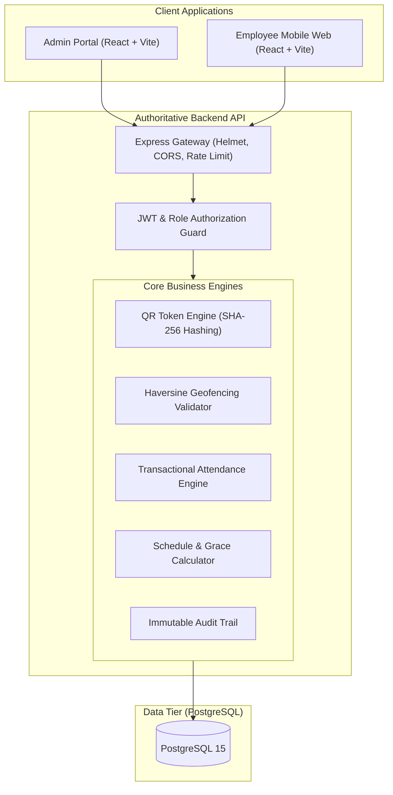

# System Architecture & Technical Design

## 1. Executive Overview

The Employee Attendance & HR Management System is an enterprise-grade modular monolith engineered for small-to-midsize companies (20–500+ employees). The system emphasizes authoritative server-side security, zero-trust frontend models, cryptographic QR code rotation, spherical Haversine geofencing, and ACID-compliant transactional attendance tracking.

---

## 2. Component Separation & Responsibilities

| Subsystem | Technology | Responsibility | Port |
| :--- | :--- | :--- | :--- |
| **Backend API** | Node.js, Express, TypeScript, Prisma | Authoritative state machine, cryptographic token lifecycle, geofence calculations, attendance transactions, rate-limiting | `4000` |
| **Admin Dashboard** | React 18, Vite, TypeScript, Tailwind CSS | Management station, live QR generation station, employee management, audited corrections, analytics, and settings | `5173` |
| **Employee Web App** | React 18, Vite, TypeScript, Tailwind CSS | Mobile-first staff portal, camera QR scanner, Geolocation API integration, leave requests, and shift calendar | `5174` |
| **Database** | PostgreSQL 15 | Relational ACID storage, foreign keys, unique compound constraints, audit logging | `5432` |

---

## 3. Zero-Trust Frontend Architecture

A critical architectural principle of this system is that **the client application is never trusted**.
- Frontend clients cannot send `isWithinGeofence = true` or `status = PRESENT`.
- Frontend clients only send **raw sensor signals**: `latitude`, `longitude`, `accuracy`, and `token`.
- The backend evaluates:
  1. Authenticated employee identity from the signed JWT bearer token.
  2. Cryptographic validity and unexpired, unrevoked state of the QR session.
  3. Spherical Haversine distance between employee coordinates and company coordinates configured in the database.
  4. Schedule assignment, late grace period, shift start/end times, and active leave records.
  5. Atomic insertion or update wrapped in a PostgreSQL transaction.
