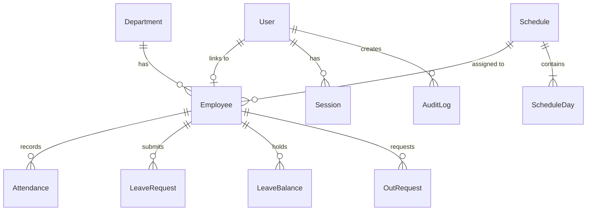

# Database Schema & Relational Data Model

## 1. Relational Entity Overview

The system uses PostgreSQL 15 managed through Prisma ORM. Strict relational constraints, foreign keys, cascade deletes, and compound indexes are enforced at the database tier.

---

## 2. Table Specifications

### `User`
- `id` (UUID, Primary Key)
- `email` (String, Unique, Indexed)
- `passwordHash` (String, Argon2 / bcrypt)
- `role` (Enum: `ADMIN`, `EMPLOYEE`)
- `status` (Enum: `ACTIVE`, `INACTIVE`, `SUSPENDED`)
- `employeeId` (UUID, Nullable, Foreign Key -> `Employee.id`)

### `Employee`
- `id` (UUID, Primary Key)
- `employeeCode` (String, Unique, Indexed)
- `firstName`, `lastName`, `displayName` (String)
- `email` (String, Unique)
- `phone` (String, Nullable)
- `departmentId` (UUID, Nullable, Foreign Key -> `Department.id`)
- `scheduleId` (UUID, Nullable, Foreign Key -> `Schedule.id`)
- `hireDate` (DateTime)
- `status` (Enum: `ACTIVE`, `INACTIVE`, `SUSPENDED`)

### `Attendance`
- `id` (UUID, Primary Key)
- `employeeId` (UUID, Foreign Key -> `Employee.id`)
- `date` (String, `YYYY-MM-DD`, Indexed)
- `checkInAt` (DateTime, Nullable)
- `checkOutAt` (DateTime, Nullable)
- `checkInLatitude`, `checkInLongitude`, `checkInAccuracy` (Float)
- `checkOutLatitude`, `checkOutLongitude`, `checkOutAccuracy` (Float)
- `checkInDistanceMeters`, `checkOutDistanceMeters` (Float)
- `checkInQrSessionId`, `checkOutQrSessionId` (UUID)
- `status` (Enum: `PRESENT`, `LATE`, `ABSENT`, `EARLY_LEAVE`, `ON_LEAVE`, `HOLIDAY`, `REST_DAY`, `INCOMPLETE`, `MANUAL_ADJUSTMENT`)
- `lateMinutes`, `earlyLeaveMinutes`, `workedMinutes` (Int)
- `notes` (Text, Audit Trail for manual edits)
- **Constraint**: `@@unique([employeeId, date])` (Guarantees single daily punch record)

### `QrSession`
- `id` (UUID, Primary Key)
- `tokenHash` (String, Unique, SHA-256 Hex Digest)
- `type` (Enum: `ANY`, `CHECK_IN`, `CHECK_OUT`)
- `expiresAt` (DateTime, Indexed)
- `revokedAt` (DateTime, Nullable)
- `usedByCount` (Int)
- `status` (Enum: `ACTIVE`, `EXPIRED`, `REVOKED`, `USED`)

### `LeaveRequest` & `LeaveBalance`
- `LeaveBalance`: Tracks yearly allowance and usage per leave type (`annual`, `sick`, `personal`, `unpaid`, `maternity`, `paternity`, `other`).
- `LeaveRequest`: Date range, days count, reason, status (`PENDING`, `APPROVED`, `REJECTED`, `CANCELLED`), reviewer comments, reviewer ID.

### `CompanySettings`
- `id` (String: `"default"`)
- `companyName` (String)
- `timezone` (String, default: `"Asia/Phnom_Penh"`)
- `latitude` (Float, default: `11.5564`)
- `longitude` (Float, default: `104.9282`)
- `allowedRadiusMeters` (Float, default: `100.0`)
- `gpsAccuracyThresholdMeters` (Float, default: `50.0`)
- `qrExpirationSeconds` (Int, default: `60`)
- `lateGracePeriodMinutes` (Int, default: `10`)

### `AuditLog`
- `id` (UUID, Primary Key)
- `actorId` (UUID, Nullable, Foreign Key -> `User.id`)
- `actorType` (Enum: `ADMIN`, `EMPLOYEE`, `SYSTEM`)
- `action` (String, e.g. `ATTENDANCE_CHECK_IN`, `QR_GENERATED`, `LEAVE_APPROVED`)
- `entityType` (String)
- `entityId` (String, Nullable)
- `metadata` (JSONB)
- `ipAddress` (String, Nullable)
- `userAgent` (String, Nullable)
- `createdAt` (DateTime, Indexed)
